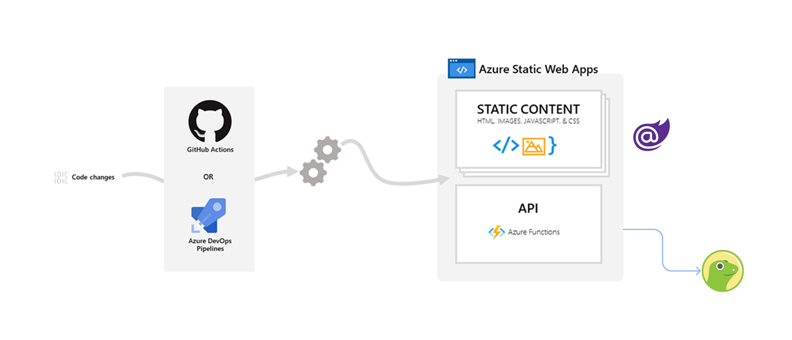
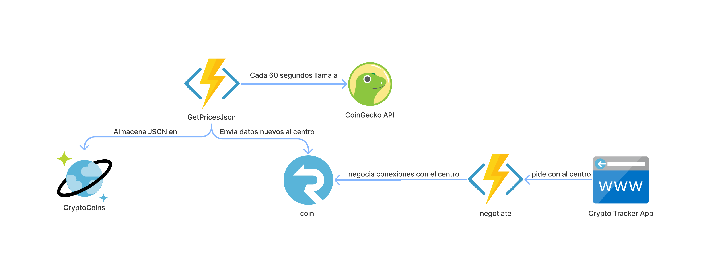

# Polling a pushed based

- **Azure Static Web Apps:** Servicio que compila e implementa automáticamente aplicaciones web de full stack desde un repositorio de código.
- **Azure Functions:** Servicio que permite ejecutar código serverless controlado por eventos.
- **Azure Cosmos DB:** Base de datos NoSQL totalmente administrada.
- **Azure SignalR Service:** Servicio que simplifica la incorporación de funcionalidades web en tiempo real a las aplicaciones a través de HTTP
- **.NET 6:** Plataforma de desarrollador open source, multiplataforma y gratuita para crear muchos tipos diferentes de aplicaciones.
- **Blazor WASM:** Framework que permite crear interfaces de usuario web interactivas utilizando C#.

## Diagramas de arquitectura

[Backend repo](https://github.com/madebygps/cumbrevirtualbackend)